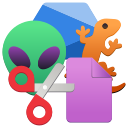
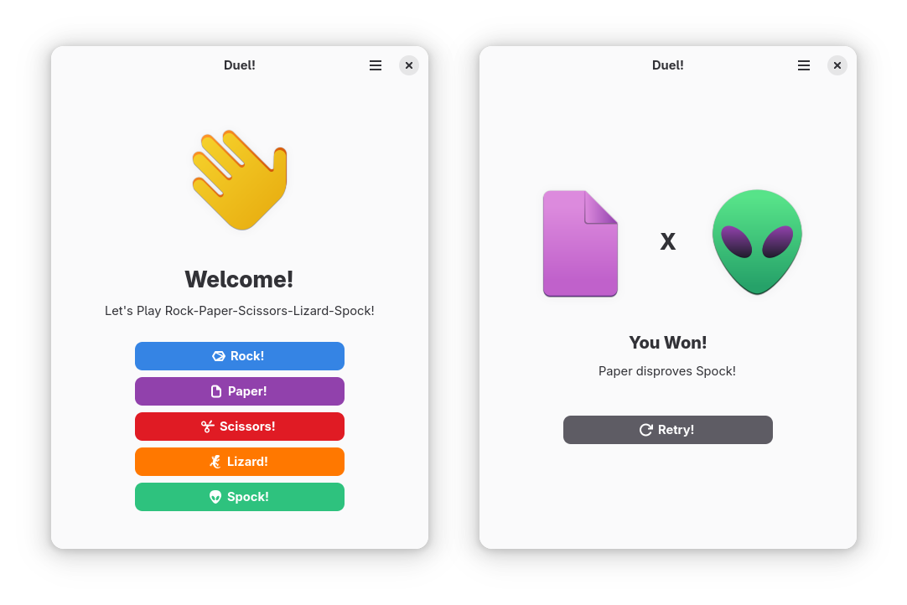
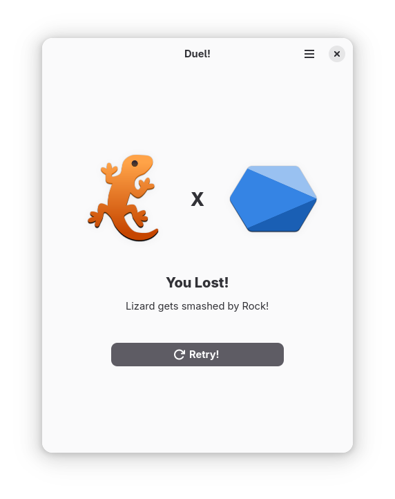
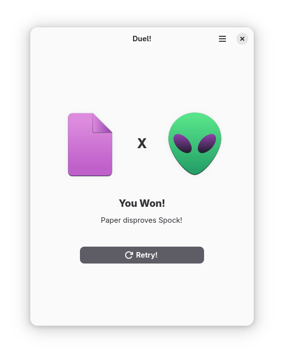
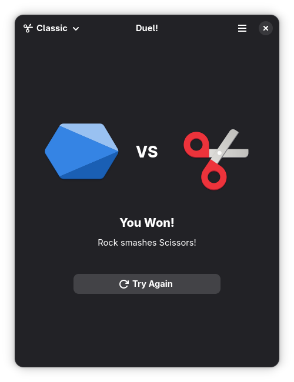
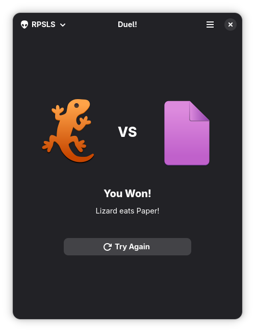

<div align="center">
  
  
  # Duel!
  
  A Rock, Paper, Scissors, Lizard, Spock game built with GTK4 and Libadwaita
  
  
</div>

---

## About

This project is a modern GNOME port of the concept presented in [ByteSebs's tutorial video](https://www.youtube.com/watch?v=WtvObZHhdf0), originally built with older technologies. Since that tutorial is now outdated (which demonstrates how fast these technologies can evolve!), I decided to recreate it using current GNOME ecosystem tools.

Instead of the classic Rock-Paper-Scissors, I implemented the **Rock-Paper-Scissors-Lizard-Spock** variant (popularized by The Big Bang Theory), as a spiritual reimplementation of a [project I made early in college](https://github.com/lloura/jokenpo).

This is a study project focused on learning GTK4, Libadwaita, and Python integration with GNOME, keeping the code simple and readable.

---

## How to Play

The rules are simple:

- **Rock** crushes Scissors and Lizard
- **Paper** covers Rock and disproves Spock
- **Scissors** cuts Paper and decapitates Lizard
- **Lizard** eats Paper and poisons Spock
- **Spock** vaporizes Rock and smashes Scissors

Choose your move and see if you can beat the computer!

---

## Technologies

- Python 3.14+
- GTK 4
- Libadwaita 1.6+ (GNOME 48)
- Blueprint Compiler
- Meson build system

---

## Installation & Running

### GNOME Builder (Recommended for Development)

1. Install [GNOME Builder](https://flathub.org/apps/org.gnome.Builder)
2. Clone this repository:
```bash
   git clone https://github.com/lloura/DuelPy.git
```
3. Open the project in GNOME Builder
4. Click the **Run** button at the top

### Flatpak (Coming Soon)

Pre-built Flatpak packages will be available in the [Releases](../../releases) section.

---

## Screenshots

<details>
<summary>Click to see more screenshots</summary>






</details>

---

## What I Learned

This project was an excellent opportunity to:

- Experiment with GTK4/Libadwaita principles and design patterns
- Get hands-on experience with GNOME Builder as an IDE
- Learn Python-GObject integration and PyGObject bindings
- Understand the Meson build system and Flatpak packaging
- Apply GNOME Human Interface Guidelines to create a modern UI

I chose Python because I plan to use it for similar projects in the future, and this served as a solid foundation for understanding the GNOME development ecosystem.

---

## Roadmap

- [x] Basic game functionality
- [ ] Quality of life improvements (Like Keybindings)
- [ ] Flatpak package for releases
- [ ] Flathub submission (😳👉️👈️)

**Contributions are welcome!** Feel free to open issues or submit pull requests.

---

## References

- Original concept: [ByteSeb's Duel](https://github.com/byteseb/Duel) and [Tutorial Video](https://www.youtube.com/watch?v=WtvObZHhdf0)
- Previous iteration: [Jokenpo+](https://github.com/lloura/jokenpo)

---

## License

This project is licensed under the [GNU General Public License v3.0](LICENSE).
